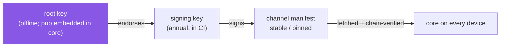

# weaveplatform-manifest

Signed channel manifests for the Weave platform: the documents that map a channel to a
known-good set of core and module versions and the protocol they assume. Core trusts nothing
it fetches until it verifies against the signing chain rooted here.

## Layout

| Path | What |
|---|---|
| `channels/stable.json` (+ `.minisig`) | The rolling channel: mutated and re-signed by CI on every promoted release. SaaS agents follow it |
| `channels/pinned/<service-version>.json` | Immutable snapshots for self-hosted deployments; created by `weavemanifest pin`, never touched again |
| `keys/root.pub` | The offline root public key, embedded in core |
| `keys/signing-<year>.pub` (+ `.minisig`) | Annual signing keys, endorsed by the root |
| `cmd/weavemanifest` | `generate \| sign \| verify \| promote \| pin` |

[`docs/trust-chain.md`](docs/trust-chain.md) diagrams the full chain — key tiers,
per-artifact enforcement, rolling vs pinned, and the promotion flow.

## Trust model

Two-tier, minisign-style Ed25519 detached signatures: an offline root key endorses annual
signing keys; signing keys sign channel manifests. Verification needs no infrastructure — an
air-gapped self-hosted deployment verifies with the root key baked into core. Rolling vs
pinned is the same schema and the same verifier with a different mutation policy.

The document schema is owned by
[`weaveplatform-api/schema/channel-manifest.schema.json`](https://github.com/deploymenttheory/weaveplatform-api).
Verification code lives in core (`weaveplatform-agent/internal/manifestverify`), deliberately
not in the SDK: a CVE is a core patch, not a rebuild of every module.

Implemented in milestone M6; this repo currently carries the schema contract and tool
skeleton.
