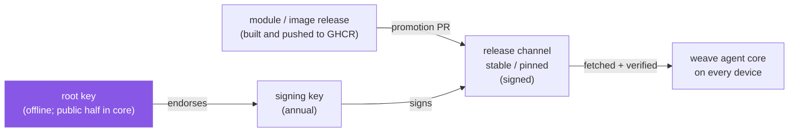

# weaveplatform-release-channels

**Which versions of the weave agent's modules and guest images every device is
allowed to run.**

Building a module or an image does not release it. A release reaches devices
only when it is listed in a release channel here, and a channel is a signed
document that the weave agent core on each device fetches, verifies against a
key compiled into it, and then follows: it installs the module versions the
channel names, refuses anything else, and hosts boot only the guest images it
lists.

This repository holds the channels, the public keys that verify them, and the
automation that proposes changes and checks them. It is data, not code: nothing
imports it.



## The channels

| Channel | What it is | Who follows it |
|---|---|---|
| `channels/stable.json` | The rolling channel. Every module and image release is proposed here by a promotion PR; **merging the PR is the release** | SaaS-managed devices, and hosts deciding which guest images to boot |
| `channels/pinned/<version>.json` | A snapshot that never changes once added | Self-hosted and air-gapped sites that certify one exact set of versions |

Each entry is exact: a module id, version and per-platform digests; an image
repository, tag and digests. Nothing is "latest".

## Why a separate, signed release channel

- **Building is not releasing.** A module or image in GHCR has only been built.
  It reaches devices when a person merges its promotion, so a bad build can be
  stopped, and a release of many modules lands as one reviewed change.
- **Devices trust the signature, not the registry.** Core accepts a channel
  only if it verifies against the offline root key compiled into core. A
  compromised registry, mirror or network path cannot add a module or swap an
  image digest.
- **No rollback or replay.** Every change raises `sequence`, and core refuses a
  document older than one it has already accepted, so a stale but validly
  signed channel cannot downgrade a device.
- **No module the device cannot run.** Every module's protocol must sit inside
  the channel's protocol window, so no device is offered a module it would
  refuse to start.
- **One list for every product and place.** Hyperscaler VMs, local VMs, cloud
  containers and local containers follow the same channel, and air-gapped
  sites verify it offline.

## Where it sits

The weave agent follows the Terraform split between core and plugins, and this
repository is the registry in that picture:

| Terraform | Weave |
|---|---|
| `hashicorp/terraform` (core; owns the plugin protocol) | [weaveplatform-agent-core](https://github.com/weaveplatform/weaveplatform-agent-core): owns the protocol, the channel schema and the verifier (`weavemanifest`) |
| `terraform-plugin-framework` and the providers | [weaveplatform-agent-modules](https://github.com/weaveplatform/weaveplatform-agent-modules): the module SDK and every module |
| The Terraform Registry, with signed provider releases | **weaveplatform-release-channels** (this repository) |
| `.terraform.lock.hcl` | core's accepted channel `sequence` and module digests |
| Provider network and filesystem mirrors | pinned channels and core's `--channel-dir` |

One difference: Terraform's registry lists every published version and users
choose with version constraints. A release channel is curated: a version is
offered only once its promotion is merged.

## Layout

| Path | What |
|---|---|
| `channels/stable.json` (+ `.sig`) | The rolling channel: updated and re-signed by the promotion PR for every published module and guest image. SaaS agents follow it; hostweave and the guestweave CLIs only run guest images it lists |
| `channels/pinned/<service-version>.json` | Immutable snapshots for self-hosted deployments; created once, never touched again, never automated |
| `keys/root.pub` | The offline root public key. The copy core trusts is embedded in the agent binary (`internal/core/keys/root.pub`); this one is for operators verifying by hand |
| `keys/signing-<year>.pub` (+ `.sig`) | Annual signing keys, endorsed by the root |
| `.github/workflows/promote.yml` | The receiver for `module-published` and `image-published` dispatches from the release pipelines |
| `.github/workflows/quality-gate.yml` | Schema, signature, sequence and pinned-immutability checks on every PR and push to main |
| `.github/agent-core-version` | The agent-core release whose schema the gate validates against and whose `weavemanifest` signs and verifies |
| `scripts/` | `promote.sh` (apply and land a promotion), `check-channels.sh` (the gate's checks), `fetch-weavemanifest.sh` |

## How a module reaches the channel

weaveplatform-agent-modules'
[`module-release.yml`](https://github.com/weaveplatform/weaveplatform-agent-modules/blob/main/.github/workflows/module-release.yml)
builds a module for every platform in its manifest, pushes the binaries to GHCR
with a digest-stamped sidecar, and dispatches `module-published` here with the
id and version. `promote.yml` pulls that sidecar, rewrites the module's entry in
`channels/stable.json`, bumps the sequence, signs when a signing key is
provisioned, and adds it to the pending promotion PR. **Merging is the
promotion act.**

## How a guest image reaches the channel

[weaveplatform-oci](https://github.com/weaveplatform/weaveplatform-oci)'s publish
pipeline runs `weaveoci publish --promotion-out entry.json` and dispatches
`image-published` here with that entry as `client_payload.image` (and
`client_payload.registry`, default `ghcr.io`). The entry names the repository
(without a registry host, so one entry admits the image from GHCR, a mirror or
an air-gapped layout), the tag, the index digest, the per-platform digests and
the expected build-time signer.

`promote.yml` treats the payload as untrusted: it checks every field against the
schema's image rules, re-resolves the tag from the registry, refuses the
promotion if the registry's index digest or children differ from the payload,
then adds or replaces the entry by repository and tag, bumps the sequence,
signs and adds it to the pending promotion PR. A manual run (`workflow_dispatch`, kind `image`) takes the
same entry as JSON.

Private registries that GitHub cannot reach promote locally instead, with the
same rules: `weaveoci channel promote` followed by `weavemanifest sign`.

## The promotion PR

Every promotion lands on one branch, `promote/stable`, with one open PR that
lists each item it carries. A release of a dozen modules dispatches a dozen
runs at once, so there is no concurrency group (GitHub would keep one pending
run and cancel the rest). Each run validates its own entry, then
`scripts/promote.sh land` applies it on the pending branch (or on `main` when
no promotion is pending) and pushes with `--force-with-lease`; a run that
loses the race to another push starts again from the new tip, up to ten
times. Re-promoting something already present changes nothing.

The run pushes and opens the PR with the org's release-please GitHub App
token (`RP_APP_ID` / `RP_APP_PRIVATE_KEY`), falling back to
`RELEASE_PLEASE_PAT` with a warning: a PR pushed with `GITHUB_TOKEN` would
never run its checks.

The quality gate runs on that PR like any other: the schema from the pinned
agent-core release, core's ParseChannel rules, every module's `protocol` inside
the channel's protocol window, `weavemanifest verify` on any
`.sig` (unsigned is a notice until a signing key is provisioned), `sequence`
never below main's and raised whenever the document changes, no change to an
existing pinned snapshot, and actionlint. [CONTRIBUTING.md](CONTRIBUTING.md)
has the same rules for hand-made changes.

## The tool

`weavemanifest` (`keygen | endorse | sign | verify`) ships with the agent
release — its `verify` *is* core's verifier, so a manifest it accepts is one
core accepts. This repository carries no copy; CI downloads the release named
in `.github/agent-core-version` and checks it against that release's
checksums.

```console
weavemanifest keygen root root                   # once, offline; root.key goes in the drawer
weavemanifest keygen signing-2026 signing-2026   # yearly
weavemanifest endorse root.key signing-2026.pub  # -> signing-2026.pub.sig
weavemanifest sign signing-2026.key channels/stable.json   # -> channels/stable.json.sig
weavemanifest verify keys/root.pub keys/signing-2026.pub channels/stable.json
```

## Trust model

Two-tier, detached Ed25519 signatures in small JSON envelopes beside each file
(`<name>.sig`). An offline root endorses annual signing keys; signing keys sign
channel manifests. Verification needs no infrastructure — an air-gapped
self-hosted deployment verifies with the root key baked into its core. Rolling
vs pinned is the same schema and the same verifier with a different mutation
policy. [`docs/trust-chain.md`](docs/trust-chain.md) has the full chain and what
each step defends against.

The document schema is
[`schema/channel-manifest.schema.json`](https://github.com/weaveplatform/weaveplatform-agent-core/blob/main/schema/channel-manifest.schema.json)
in agent-core. Core owns the types (`internal/protocol/manifest`) and the
verifier (`internal/manifestverify`); modules see the same types through the
module SDK in
[weaveplatform-agent-modules](https://github.com/weaveplatform/weaveplatform-agent-modules)
(`sdk/protocol/manifest`).

## Still to decide

Core fetches the channel bundle over HTTP (`--manifest-url`). This repository
is public, but something still has to *serve* `channels/` at a stable URL:
raw repository content, GitHub Pages, or the bundle pushed to GHCR beside the
modules. The same decision
covers the module binaries themselves, which today live only in the OCI store.
