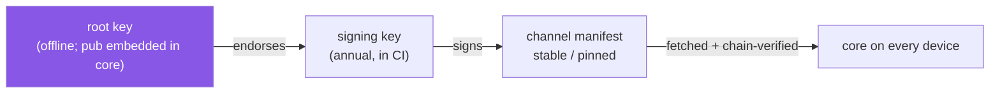

# weaveplatform-channels

The signed channel manifests for the Weave platform, and the public half of the
keys that sign them. Data, not code: nothing here is imported by anything, and
the only workflow opens promotion PRs.

Core trusts nothing it fetches until it verifies against the chain rooted here.



## Layout

| Path | What |
|---|---|
| `channels/stable.json` (+ `.sig`) | The rolling channel: updated and re-signed by the promotion PR for every published module and guest image. SaaS agents follow it; hostweave and the guestweave CLIs only run guest images it lists |
| `channels/pinned/<service-version>.json` | Immutable snapshots for self-hosted deployments; created once, never touched again, never automated |
| `keys/root.pub` | The offline root public key. The copy core trusts is embedded in the agent binary (`internal/core/keys/root.pub`); this one is for operators verifying by hand |
| `keys/signing-<year>.pub` (+ `.sig`) | Annual signing keys, endorsed by the root |
| `.github/workflows/promote.yml` | The receiver for `module-published` and `image-published` dispatches from the release pipelines |

## How a module reaches the channel

The platform repository's reusable
[`module-release.yml`](https://github.com/weaveplatform/weaveplatform-agent-core/blob/main/.github/workflows/module-release.yml)
builds a module for every platform in its manifest, pushes the binaries to GHCR
with a digest-stamped sidecar, and dispatches `module-published` here with the
id and version. `promote.yml` pulls that sidecar, rewrites the module's entry in
`channels/stable.json`, bumps the sequence, signs when a signing key is
provisioned, and opens a PR. **Merging is the promotion act.**

## How a guest image reaches the channel

[weaveplatform-oci](https://github.com/weaveplatform/weaveplatform-oci)'s publish
pipeline runs `weaveoci publish --promotion-out entry.json` and dispatches
`image-published` here with that entry as `client_payload.image` (and
`client_payload.registry`, default `ghcr.io`). The entry names the repository
(without a registry host, so one entry admits the image from GHCR, a mirror or
an air-gapped layout), the tag, the index digest, the per-platform digests and
the expected build-time signer.

`promote.yml` treats the payload as untrusted: it checks every field against the
schema's image rules, re-resolves the tag from the registry, refuses the
promotion if the registry's index digest or children differ from the payload,
then adds or replaces the entry by repository and tag, bumps the sequence,
signs and opens a PR. A manual run (`workflow_dispatch`, kind `image`) takes the
same entry as JSON.

Private registries that GitHub cannot reach promote locally instead, with the
same rules: `weaveoci channel promote` followed by `weavemanifest sign`.

## The tool

`weavemanifest` (`keygen | endorse | sign | verify`) ships with the agent
release — its `verify` *is* core's verifier, so a manifest it accepts is one
core accepts. This repository carries no copy.

```console
weavemanifest keygen root root                   # once, offline; root.key goes in the drawer
weavemanifest keygen signing-2026 signing-2026   # yearly
weavemanifest endorse root.key signing-2026.pub  # -> signing-2026.pub.sig
weavemanifest sign signing-2026.key channels/stable.json   # -> channels/stable.json.sig
weavemanifest verify keys/root.pub keys/signing-2026.pub channels/stable.json
```

## Trust model

Two-tier, detached Ed25519 signatures in small JSON envelopes beside each file
(`<name>.sig`). An offline root endorses annual signing keys; signing keys sign
channel manifests. Verification needs no infrastructure — an air-gapped
self-hosted deployment verifies with the root key baked into its core. Rolling
vs pinned is the same schema and the same verifier with a different mutation
policy. [`docs/trust-chain.md`](docs/trust-chain.md) has the full chain and what
each step defends against.

The document schema is
[`schema/channel-manifest.schema.json`](https://github.com/weaveplatform/weaveplatform-agent-core/blob/main/schema/channel-manifest.schema.json)
in the platform repository; the Go types are `sdk/manifest`; the verifier is
`internal/manifestverify`.

## Still to decide

Core fetches the channel bundle over HTTP (`--manifest-url`), and this
repository is private. Something has to *serve* `channels/` — make this
repository public (it holds only public keys and signed documents), publish to
GitHub Pages, or push the bundle to GHCR beside the modules. The same decision
covers the module binaries themselves, which today live only in the OCI store.
