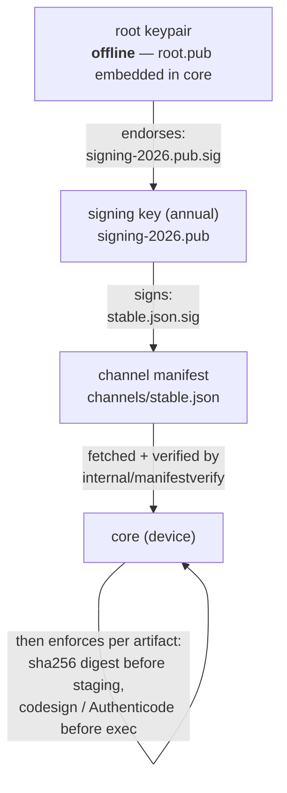

# The trust chain

How core decides a channel manifest is worth believing, and how a module version travels
from a git tag to a device — with no signing infrastructure required to verify anywhere.

## Two tiers, detached signatures



Everything is a detached Ed25519 signature in a small JSON envelope beside the file
(`<name>.sig`). Verification is ~200 lines in core
([`internal/manifestverify`](https://github.com/deploymenttheory/weaveplatform-agent-core/tree/main/internal/manifestverify)),
deliberately not in the SDK: a CVE is a core patch, not a rebuild of every module. An
air-gapped self-hosted deployment verifies with nothing but the root key already baked into
its core binary — no Fulcio, no Rekor, no CA.

Layered on top, per artifact: the channel manifest carries each binary's sha256 digest
(enforced before staging) and the platform signing identity (codesign Team ID, Authenticode
subject — enforced before every exec).

## Rolling vs pinned

Same schema, same verifier, different mutation policy:

- `channels/stable.json` — **rolling**: CI re-signs it on every promoted release; SaaS
  agents poll and reconcile.
- `channels/pinned/<service-version>.json` — **immutable snapshots** for self-hosted:
  created once, never touched; the deployment is configured with the file's URL and expected
  digest.

## The tool

```console
weavemanifest keygen <key-id> <out-prefix>    # generate a keypair
weavemanifest endorse <root.key> <signing.pub>  # root-endorse a signing key
weavemanifest sign <signing.key> <file>         # sign a manifest
weavemanifest verify <root.pub> <signing.pub> <file>  # verify the full chain
```

`weavemanifest` ships with the agent release; this repository carries no copy of it.
The root private key never touches CI — it exists to endorse each year's signing key and
goes back in the drawer. Signing keys live in CI secrets and are rotated by generating a new
one and endorsing it; nothing deployed changes, because devices trust the root, not the
signing key.

## Promotion

When a module publishes (through the platform repository's reusable
[`module-release.yml`](https://github.com/deploymenttheory/weaveplatform-agent-core/blob/main/.github/workflows/module-release.yml)),
the pipeline sends a `repository_dispatch` here with the module id and version.
[`promote.yml`](../.github/workflows/promote.yml) pulls the published sidecar, updates
`channels/stable.json` with the new distribution subset, re-signs, and opens a PR —
merge is the promotion act. Pinned channels are never touched by automation.
